# MCP Demo 工作流程圖

本文檔包含 MCP Demo 項目的各種流程圖，使用 Mermaid 格式繪製。

## 1. 系統架構圖


## 2. VLLM Client 初始化流程


## 3. 對話和工具調用主流程


## 4. 工具調用處理流程

```mermaid
sequenceDiagram
    participant VC as VLLMClient
    participant MC as MCPClient
    participant MS as MCP Server
    participant Tool as get-date Tool

    Note over VC: 收到含 tool_calls 的<br/>assistant message

    VC->>VC: handleToolCalls(assistantMessage)

    loop 每個 tool_call
        VC->>VC: 解析 tool call arguments

        VC->>MC: callTool(name, args)
        activate MC

        MC->>MS: CallToolRequest<br/>{name, arguments}
        activate MS

        MS->>MS: 驗證 tool name

        alt tool 是 get-date
            MS->>Tool: 執行 get-date 邏輯
            activate Tool
            Tool->>Tool: 解析 format 參數
            Tool->>Tool: 解析 timezone 參數
            Tool->>Tool: 生成日期時間字串
            Tool-->>MS: 日期時間結果
            deactivate Tool
        else 未知 tool
            MS->>MS: 拋出錯誤
        end

        MS-->>MC: {content: [{type: "text", text: result}]}
        deactivate MS

        MC-->>VC: content[0] (text result)
        deactivate MC

        VC->>VC: 創建 tool result message<br/>{role: "tool", tool_call_id, content}
    end

    VC->>VC: 將所有 tool results<br/>加入 conversation history

    Note over VC: 準備下一輪 VLLM 請求
```



## 5. MCP Client 工具調用詳細流程

```mermaid
flowchart TD
    Start([callTool被調用]) --> PrepareReq[準備 CallToolRequest<br/>{name, arguments}]

    PrepareReq --> SendReq[client.callTool<br/>發送到 MCP Server]

    SendReq --> WaitResp[等待響應<br/>透過 stdio]

    WaitResp --> RecvResp[接收響應]

    RecvResp --> ExtractContent[提取 response.content]

    ExtractContent --> GetFirst[返回 content[0]<br/>作為結果]

    GetFirst --> End([結束])

    style Start fill:#e1f5ff
    style SendReq fill:#fff4e1
    style End fill:#c8e6c9
```

## 6. 文本工具調用解析流程

```mermaid
flowchart TD
    Start([檢查 assistant.content]) --> HasContent{content<br/>存在?}

    HasContent -->|否| NoToolCall[返回 null]

    HasContent -->|是| Regex[使用正則表達式匹配<br/>&lt;tool_call&gt;...&lt;/tool_call&gt;]

    Regex --> Found{找到<br/>匹配?}

    Found -->|否| NoToolCall

    Found -->|是| ExtractJSON[提取 JSON 內容]

    ExtractJSON --> ParseJSON{JSON.parse<br/>成功?}

    ParseJSON -->|失敗| LogError[記錄錯誤]
    LogError --> NoToolCall

    ParseJSON -->|成功| CreateToolCall[創建 ToolCall 對象<br/>{id, type, function}]

    CreateToolCall --> GenID[生成 ID:<br/>call_timestamp]

    GenID --> SetFields[設置 name 和 arguments]

    SetFields --> Return[返回 ToolCall]

    NoToolCall --> End([結束: null])
    Return --> End2([結束: ToolCall])

    style Start fill:#e1f5ff
    style Return fill:#c8e6c9
    style End fill:#ffcdd2
    style End2 fill:#c8e6c9
```

## 7. 完整對話示例時序圖


## 8. 斷線和清理流程


## 流程圖說明

### 1. 系統架構圖
展示了整個系統的組件和它們之間的通訊方式。

### 2. VLLM Client 初始化流程
說明了 VLLMClient 如何創建、連接 MCP Server、獲取工具列表並進行格式轉換。

### 3. 對話和工具調用主流程
核心的 agentic loop 流程，展示了如何處理用戶消息、調用 VLLM、處理工具調用、以及迭代直到獲得最終答案。

### 4. 工具調用處理流程
詳細展示了當模型請求工具調用時，如何與 MCP Server 交互並獲取結果。

### 5. MCP Client 工具調用詳細流程
展示了 MCPClient.callTool 方法的內部流程。

### 6. 文本工具調用解析流程
說明了當模型不支持原生 tool calls 時，如何從文本中解析 `<tool_call>` 標籤。

### 7. 完整對話示例時序圖
展示了一個完整的用戶查詢從開始到結束的所有步驟和組件交互。

### 8. 斷線和清理流程
說明了如何正確關閉連接和清理資源。

## 關鍵技術點

- **Stdio Transport**: MCP Client 和 Server 之間使用 stdin/stdout 進行 JSON-RPC 通訊
- **Agentic Loop**: 最多 5 次迭代，支持多輪工具調用
- **雙模式工具調用**: 支持原生 tool_calls 和文本解析兩種方式
- **異步初始化**: 使用靜態 async factory 方法處理異步設置
- **對話歷史管理**: 完整保存 system、user、assistant、tool 消息
- **錯誤處理**: 各個層級都有完善的錯誤處理機制
