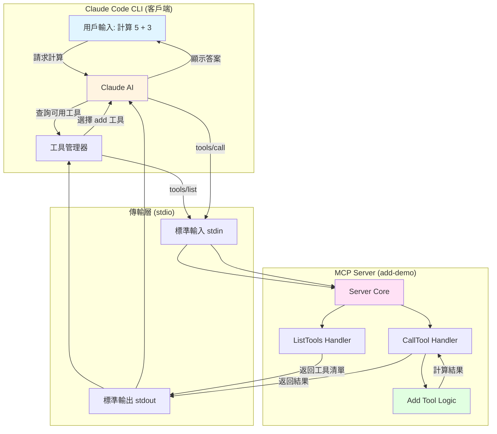
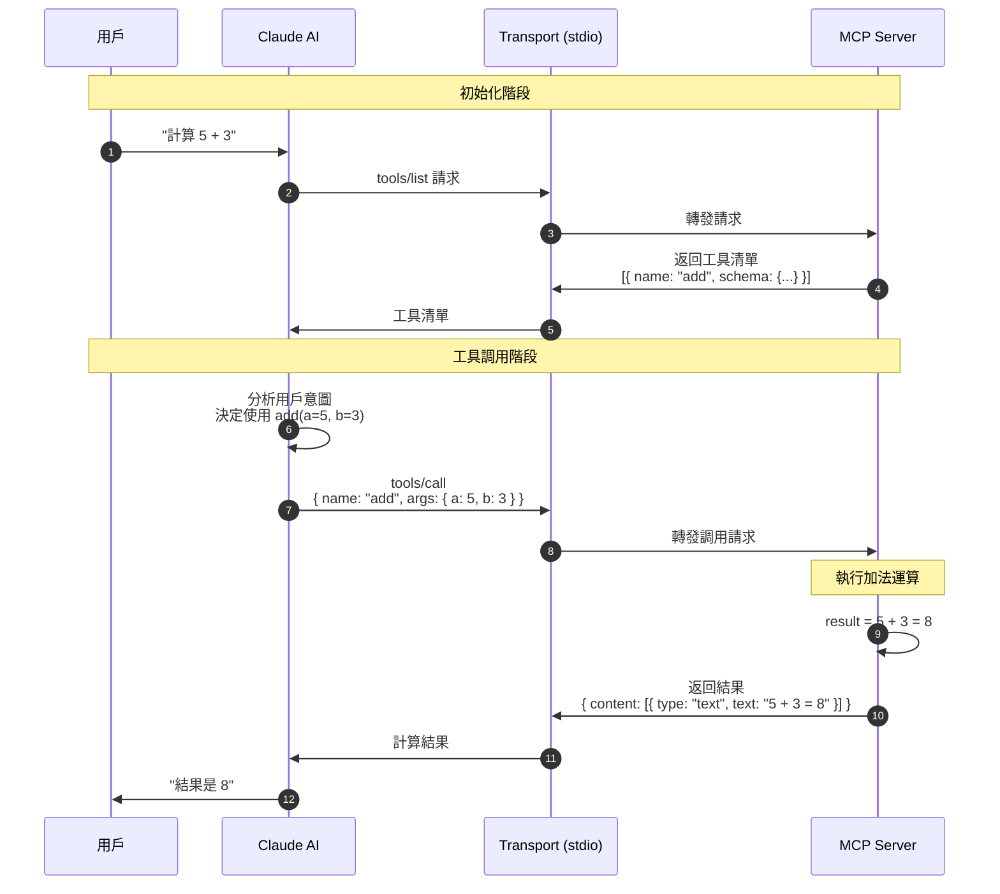
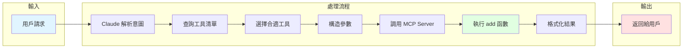
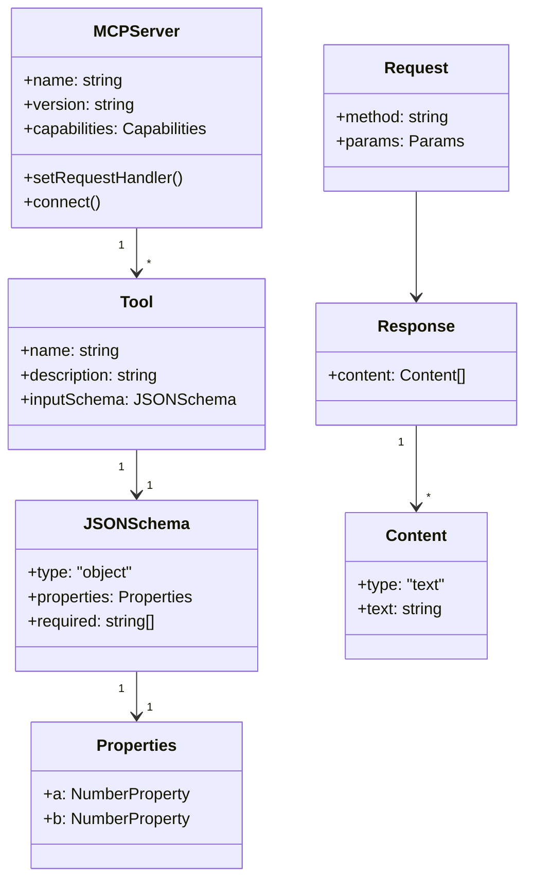
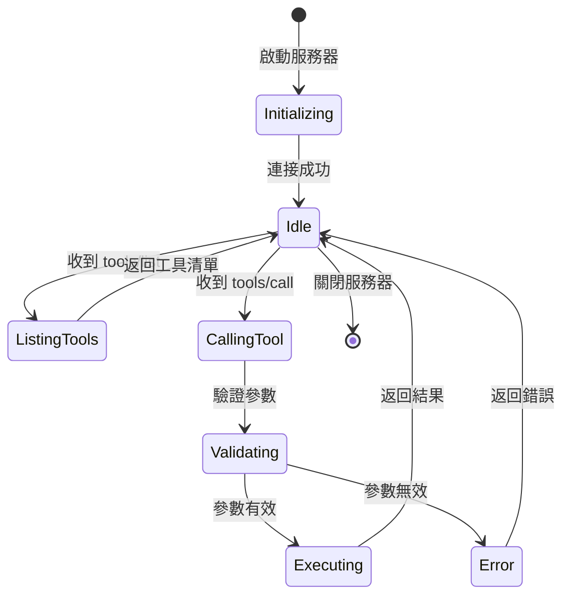
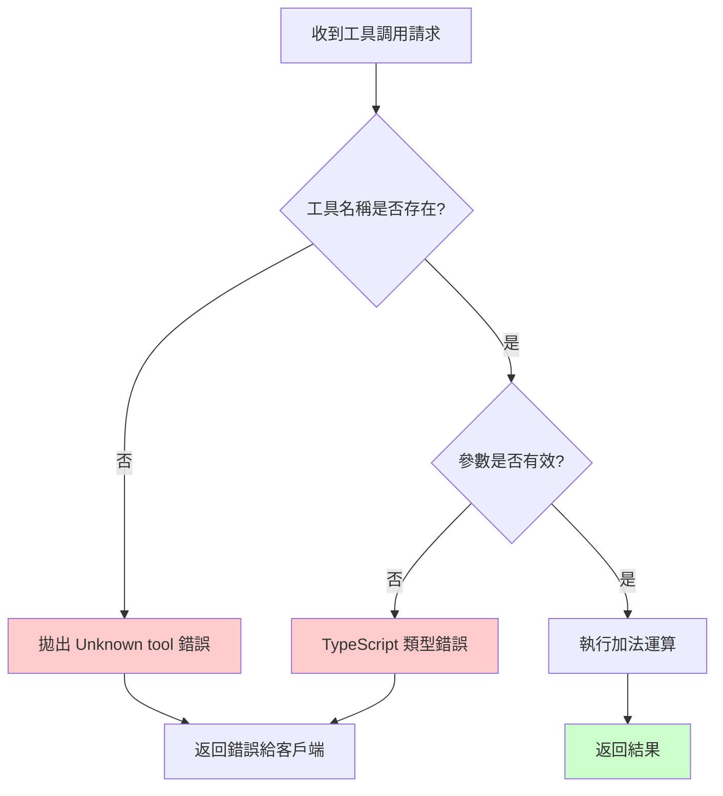
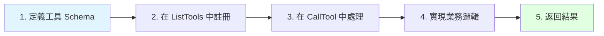
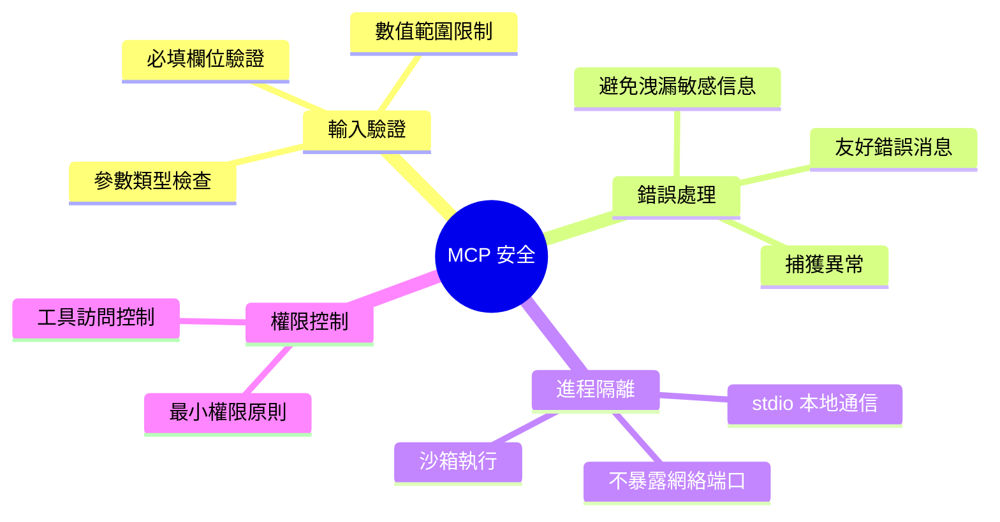

# MCP Add Demo 技術規格

## 架構概述

這是一個基於 Model Context Protocol (MCP) 的簡單加法服務器實現。

## 系統架構圖



## MCP 通信流程時序圖



## 數據流圖



## 工具定義結構



## 狀態機圖



## 核心組件說明

### 1. Server 初始化
- 創建 Server 實例
- 聲明 capabilities（能力）
- 設置 Request Handlers

### 2. Transport Layer
- **類型**: stdio (標準輸入/輸出)
- **協議**: JSON-RPC 2.0
- **通信方式**: 雙向流式通信

### 3. Request Handlers
- **ListToolsRequestSchema**: 返回可用工具列表
- **CallToolRequestSchema**: 執行工具調用

### 4. Tool Schema
使用 JSON Schema 定義工具參數：
```json
{
  "type": "object",
  "properties": {
    "a": { "type": "number", "description": "第一個數字" },
    "b": { "type": "number", "description": "第二個數字" }
  },
  "required": ["a", "b"]
}
```

## 錯誤處理



## 技術規格

| 項目 | 說明 |
|------|------|
| **協議** | Model Context Protocol (MCP) |
| **傳輸層** | stdio |
| **數據格式** | JSON |
| **編程語言** | TypeScript |
| **運行時** | Node.js |
| **SDK** | @modelcontextprotocol/sdk |

## API 端點

### 1. ListTools
**請求**:
```json
{
  "jsonrpc": "2.0",
  "method": "tools/list",
  "id": 1
}
```

**響應**:
```json
{
  "jsonrpc": "2.0",
  "result": {
    "tools": [
      {
        "name": "add",
        "description": "Add two numbers together and return the result",
        "inputSchema": {
          "type": "object",
          "properties": {
            "a": { "type": "number" },
            "b": { "type": "number" }
          },
          "required": ["a", "b"]
        }
      }
    ]
  },
  "id": 1
}
```

### 2. CallTool
**請求**:
```json
{
  "jsonrpc": "2.0",
  "method": "tools/call",
  "params": {
    "name": "add",
    "arguments": {
      "a": 5,
      "b": 3
    }
  },
  "id": 2
}
```

**響應**:
```json
{
  "jsonrpc": "2.0",
  "result": {
    "content": [
      {
        "type": "text",
        "text": "The sum of 5 + 3 = 8"
      }
    ]
  },
  "id": 2
}
```

## 擴展性設計

### 添加新工具的步驟



### 示例：添加減法工具

```typescript
// 1. 在 ListTools 中添加
tools: [
  { name: "add", ... },
  {
    name: "subtract",
    description: "Subtract b from a",
    inputSchema: {
      type: "object",
      properties: {
        a: { type: "number" },
        b: { type: "number" }
      },
      required: ["a", "b"]
    }
  }
]

// 2. 在 CallTool 中處理
if (request.params.name === "subtract") {
  const { a, b } = request.params.arguments;
  return {
    content: [{ type: "text", text: `${a} - ${b} = ${a - b}` }]
  };
}
```

## 安全考量



## 性能指標

| 指標 | 目標值 |
|------|--------|
| 工具調用延遲 | < 10ms |
| 內存使用 | < 50MB |
| 啟動時間 | < 1s |
| 並發請求處理 | 順序處理（stdio 特性） |

## 參考資源

- [MCP 官方文檔](https://modelcontextprotocol.io)
- [MCP SDK GitHub](https://github.com/modelcontextprotocol/sdk)
- [JSON Schema 規範](https://json-schema.org)
