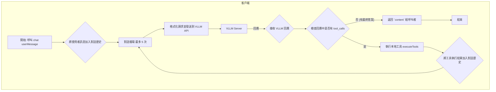
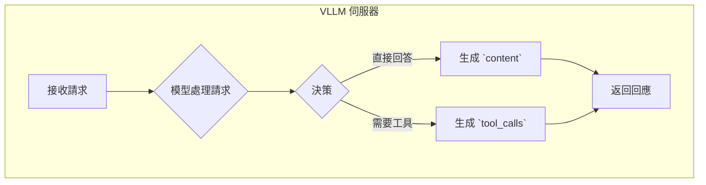

好的，這是在 `vllm-client.ts` 中處理流程的 Mermaid 流程圖。我會將它寫入 `SpecV3.md` 檔案。

這張圖解釋了從客戶端（Client）發送請求給 VLLM，VLLM 決定是否使用工具（Tool），客戶端再根據情況執行工具或返回最終答案的完整循環。

```mermaid
graph TD
    subgraph Client [客戶端]
        A[開始: 呼叫 chat userMessage] --> B{將使用者訊息加入對話歷史};
        B --> C[對話循環 最多 5 次];
        C --> D[格式化請求並發送到 VLLM API];
        D --> E[VLLM Server];
        E -- 回應 --> F{接收 VLLM 回應};
        F --> G{檢查回應中是否有 tool_calls};
        G -- 否 [有最終答案] --> H[返回 `content` 給呼叫者];
        G -- 是 --> I[執行本地工具 executeTools];
        I --> J{將工具執行結果加入對話歷史};
        J --> C;
        H --> K[結束];
    end
```

```mermaid
graph TD

    subgraph VLLM Server [VLLM 伺服器]
        E_IN[接收請求] --> E_PROC{模型處理請求};
        E_PROC --> E_DEC{決策};
        E_DEC -- 直接回答 --> E_ANS[生成 `content`];
        E_DEC -- 需要工具 --> E_TOOL[生成 `tool_calls`];
        E_ANS --> E_OUT[返回回應];
        E_TOOL --> E_OUT;
    end

```