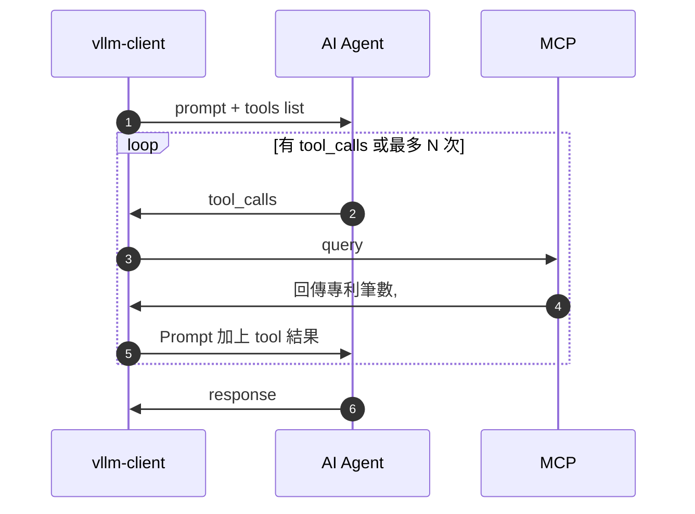

# 流程

```mermaid
sequenceDiagram
    autonumber
    participant PPS as vllm-client
    participant AA as AI Agent
    participant MCP as MCP

    PPS->>AA: prompt + tools list

    loop 有 tool_calls 或最多 N 次
    AA->>PPS: tool_calls
    PPS->>MCP: query
    MCP->>PPS: 回傳專利筆數,
    PPS->>AA: Prompt 加上 tool 結果
    end

    AA->>PPS: response

```

## 第一次送出使用 prompt.txt
## 接收到 tool_call 取得專利筆數再送出時也是送 prompt.txt
