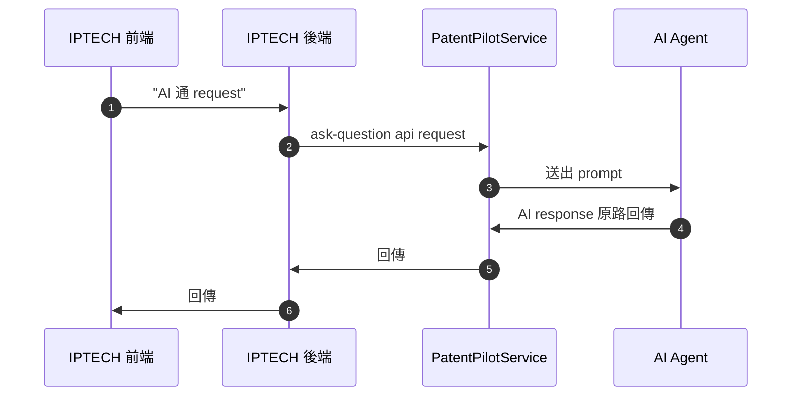
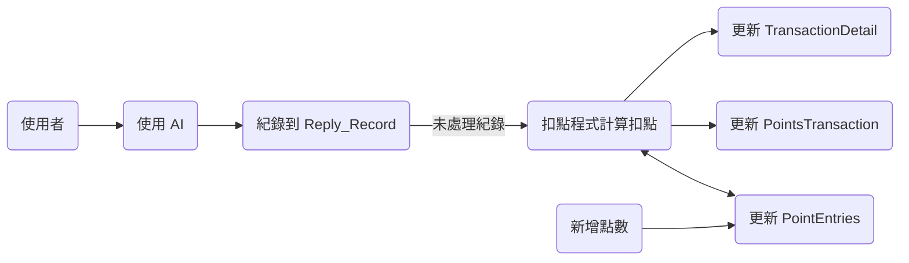

# sse

```mermaid
sequenceDiagram
    autonumber
    participant I as IPTECH 前端
    participant IS as IPTECH 後端
    participant PPS as PatentPilotService
    participant AA as AI Agent

    I->>IS: "AI 通 request"
    IS->>PPS: ask-question api request
    PPS->>AA: 送出 prompt
    AA->>PPS: AI response 原路回傳
    PPS->>IS: 回傳
    IS->>I:回傳
```

---

# 點數

```mermaid
flowchart LR
    A(使用者) --> B(使用 AI)
    B --> C(紀錄到 Reply_Record)
    C --未處理紀錄--> D(扣點程式計算扣點)
    D <--> E(更新 PointEntries)
    D --> F(更新 PointsTransaction)
    D --> G(更新 TransactionDetail)
    H(新增點數) --> E

```