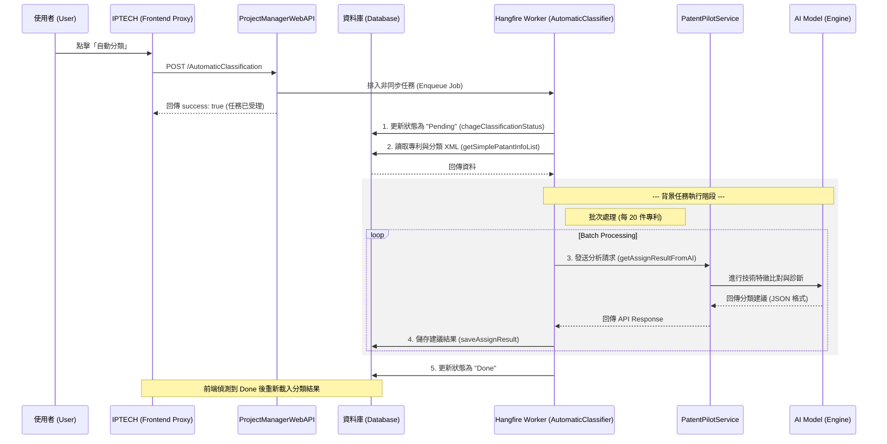

# 分類通

## 功能概念

「分類通」是用來讓使用者透過 AI，自動重新整理目前的分類樹。
使用者可以選擇是否提供一段「分類策略」，讓 AI 在分類時參考。

整個流程分成三個階段：

1. AI 分析現況
2. 使用者輸入策略
3. 確認並執行分類
---
## 畫面與流程說明

### 1️⃣ AI 分析（第一頁）

當使用者開啟功能時，會先看到 AI 對目前分類狀態的說明。

* 畫面上有一段 **逐字顯示的 AI 文字**
* 顯示目前的分類樹（只能看，不能操作）
### 2️⃣ 分類策略（第二頁）

這一頁讓使用者輸入「想怎麼分類」的簡單描述。
* 輸入欄位可以輸入文字
* 也可以完全不輸入（允許空白）
* 分類樹仍然可見（與第一頁一致）
### 3️⃣ 確認執行（第三頁）

這一頁會先由 AI 說明「將如何依照策略分類」，之後才能開始執行。
* AI 說明會逐字顯示
* 在 AI 顯示完成前，「開始分類」按鈕不能點
## 分類執行行為

當使用者開始分類後：
* 畫面出現進度（例如：已完成 / 總數）
* 分類樹有「正在處理」的視覺效果
* 操作按鈕被限制（避免誤操作）

分類完成後：
* 會顯示成功提示
* 分類樹會更新
## 關閉行為

分類通有兩種不同的關閉情境：
### 🔹 尚未開始分類
* 直接關閉，不需提示
### 🔹 分類進行中
* 會出現提醒：
  - 即使關閉，分類仍會在背景繼續

## 分類通時序圖 (Sequence Diagram)

## 點數顯示及不足之處理
- 在視窗中，顯示「預計消耗點數」，設計顯眼一點，僅顯示就好，若點數不足，無須阻止使用者繼續操作。
- 在分類通進行中時，在取得分類進度時，若發現點數不足，則在分類通的視窗中顯示「點數不足」，並且在分類通的視窗中提供一個按鈕，讓使用者可以點擊後前往購買點數的頁面。

## 合併分類規格
### 前情提要

- 在合併模式下，使用移動功能移動專利，移動主件，子件的專利也跟著移動。

### 討論問題

- 在分類通時，目前將所有未分類專利進行分類，在合併模式下亦是如此，故在畫面上顯示合併完 310 件專利進行分類，但實際可能會是 360 專利進行分類。
